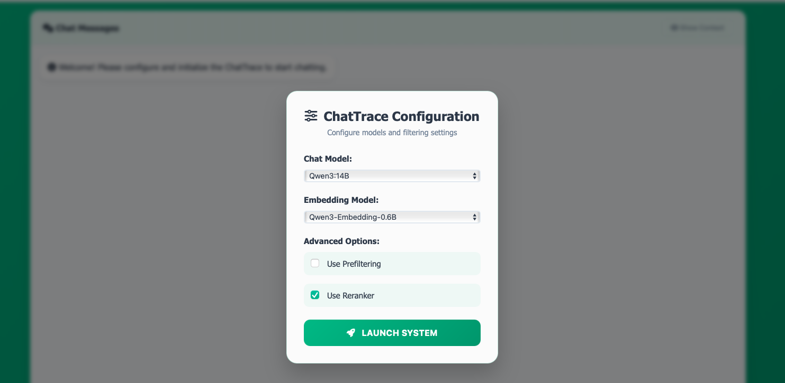

# 💬 ChatTrace : retrieve and inquire on past chats  

This application allows you to upload your own chat history, it then processes it and sets up a RAG system that allows you to ask questions about your messages.  

✨ **Important points** :  

- 🛡️ Runs locally through **llama.cpp** → private messages do not leave your machine  
- 📱 Supports both **Instagram** and **WhatsApp** message formats  
- 🌍 Handles **multilingual** messages, even in the same chat  
- 🐳 Has **Docker** support, with handy `docker-compose` file to run all 3 necessary applications  

---




## 📥 Downloading Chat History  


### 📲 WhatsApp  

WhatsApp does not allow you to download multiple chats or your entire chat history at once, but you can [export one chat history](https://faq.whatsapp.com/1180414079177245/?helpref=platform_switcher&cms_platform=iphone&cms_id=1180414079177245&draft=false).  

⚠️ The current implementation of ChatTrace is not multimodal, so you should select **"Without Media"**.  

---

### 📸 Instagram  

With Instagram, it is possible to [export your whole information at once](https://help.instagram.com/1224884341728748?helpref=faq_content) through the app.  

⚠️ **Important** : During export, you are asked which format the data should be in (HTML or JSON). You must choose **JSON**.  

💡 Instagram also offers a **"Customise information"** setting — from there we can leave only **Messages**, since that is the only extracted data.  

---

## 🚀 Run Application  

This application has several different configurations. Mainly it is a Python app, that uses the **llama.cpp** inference engine:  
- with the **Ollama wrapper** (for the Chat and Embedding Model)  
- without it (for the **Reranker model**)  

---

#### 📂 Chat files location  

- **WhatsApp** : Place the zipped chats in `data/whatsapp/zipped_chats`, or the unzipped text chats in `data/whatsapp/whatsapp_chats`.  
- **Instagram** : Place the entire unzipped folder in `data/instagram`.  

---

#### 🐳 Docker support  

The project has full Docker support, so no used applications (Python, Ollama, llama.cpp) need to be downloaded. Each has its own container, orchestrated through **docker-compose**.  

▶️ To start the application through Docker (on CPU), [first make sure you have Docker engine running](https://docs.docker.com/get-started/introduction/get-docker-desktop/), and then run:  

```bash
docker compose -f docker-compose-dockerized.yml up --build
```

⚠️ __Note__ : Regarding GPU use, Unfortunately `llama.cpp` (and in turn Ollama, which is just a wrapper of `llama.cpp`) can only use the GPU on **NVIDIA-based architectures**. To support that, a [toolkit needs to be installed](https://hub.docker.com/r/ollama/ollama). Luckily for Windows, Docker Desktop sets it up for you, you just need to follow some simple steps in Docker Desktop to [enable GPU support](https://docs.docker.com/desktop/features/gpu/). And then run:

```bash
docker compose -f docker-compose-gpu.yml up --build
```
However, the current implementation can run comfortably on a **CPU**, as the default models are relatively small. ⚡ **Warning**: using the reranker model on CPU is incredibly slow and can take **minutes per request**.  

💡 As an alternative, you can install [Ollama](https://ollama.com/download/mac) and [llama-cpp](https://github.com/ggml-org/llama.cpp) locally on the host machine and run local servers. This will make everything significantly faster and is advised if you don't mind cluttering your machine.When both servers are running, start with:  

```bash
docker compose -f docker-compose-local.yml up --build
```

⚠️ __Note__: There is also a requirements file (`requirements-docker.txt`), which allows the Python app to be run on your local machine, assuming Python is installed.  

💡 **Important**: If you run it locally without Docker, you will lose the orchestration of `docker-compose` and need to run two commands manually (as well as install ollama/llama.cpp and start them locally with appropriate ports):  

```bash
python process_data.py
python app.py
```

## 🛠️ Implementation Details

#### 🔹 Ollama

The main components of the RAG system (the Chat and Embedding model) are obtained from **Ollama**.  

Ollama is primarily used as a **local inference engine** with integration support in **LangChain**.  

#### 🔹 Llama.cpp

`llama.cpp` is the inference engine for Ollama.  

- Provides **lower-level access** in its requests, which is necessary for the **Reranker model** (requires exposed logits from the last layer).  
- Supports **continuous batching**, allowing multiple requests to be processed asynchronously (processing input tokens of one request while generating tokens for another).  
- While not as efficient as **dynamic batching**, it increases throughput and, unlike [vLLM](https://github.com/vllm-project/vllm), it is **not constrained by architecture type**.  


#### 📚💬 Models

The [Qwen3 series of models](https://qwenlm.github.io/blog/qwen3/) are the main models used in the project, this is due to their strong multilingual ability, this is considering that most eurpoeans speak english with international friends, and their native language with friends and family from home. For the chat models, the Qwen3-8B and Qwen3-14B model are chosen, which are not instruction-tuned, were used as the chat models ( following [this work](https://arxiv.org/html/2406.14972v1) that found that non-instruct models can be significantly better at chat, as well as some own experiments with Qwen2.5-instruct). Regarding the embedding and reranking models, smaller [Qwen3 models of 0.6B and 4B are used](https://arxiv.org/abs/2506.05176), as they show very strong performance, especially considering multilingual data. Following the release of [embeddingemma](https://arxiv.org/abs/2509.20354), that was also added as a more budget alternative.
